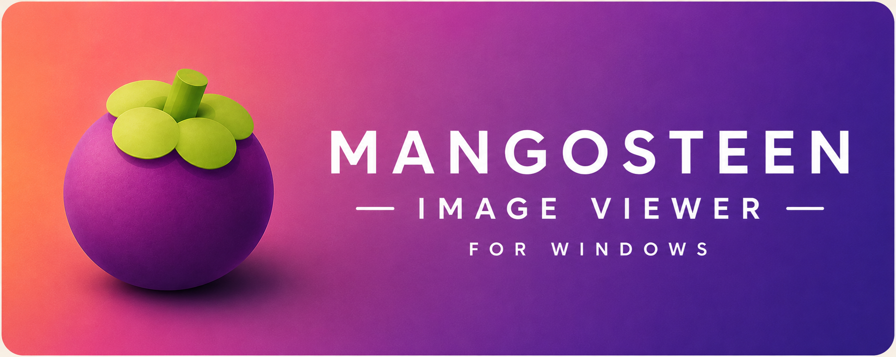
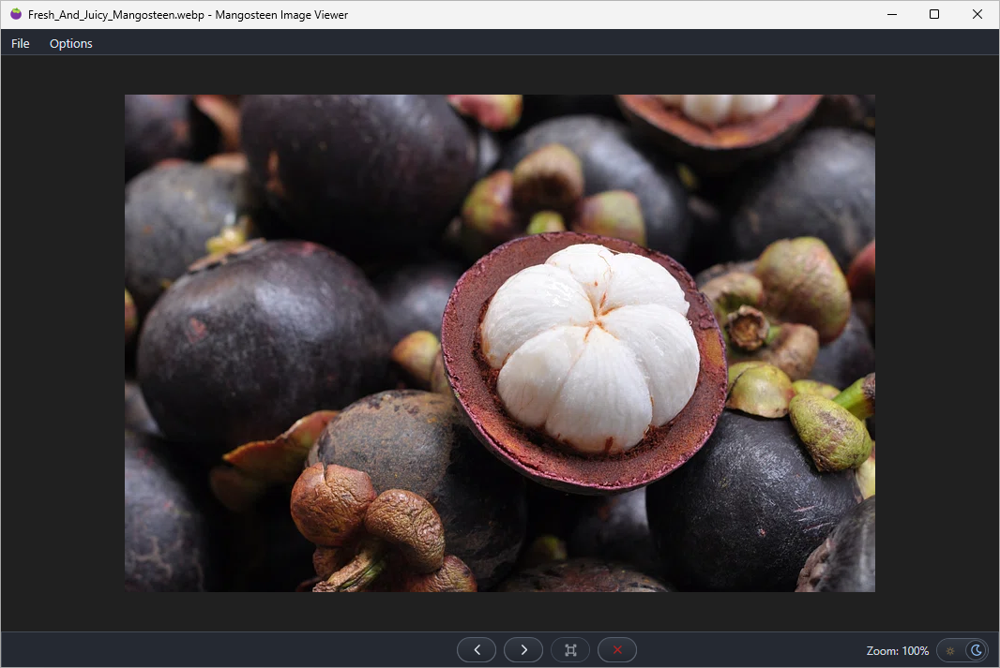
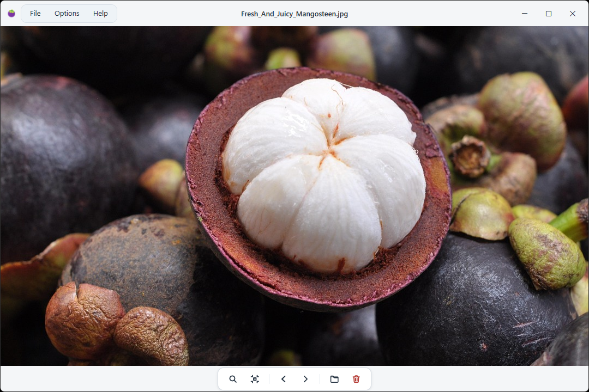

# Mangosteen Image Viewer



[](https://github.com/sapere-aude-incipe/mangosteen-image-viewer/actions/workflows/ci.yml)
[](https://github.com/sapere-aude-incipe/mangosteen-image-viewer/releases)
[](LICENSE)

### [Download Portable (.zip)](https://github.com/sapere-aude-incipe/mangosteen-image-viewer/releases) | [Download Installer (.exe)](https://github.com/sapere-aude-incipe/mangosteen-image-viewer/releases)

Mangosteen Image Viewer is a simple, fast, privacy-respecting Windows image viewer inspired by the classic Windows Photo Viewer experience. It is built for the everyday flow of opening an image, moving through a folder, zooming, panning, checking actual pixels, and getting back to what you were doing.

Mangosteen keeps the interface quiet, starts quickly, supports modern image formats, and does not include telemetry, tracking, accounts, cloud sync, or background data collection. It is free and open source under the MIT License.

## Screenshots

| Dark theme | Light theme |
| --- | --- |
|  |  |

## Features

- Privacy-respecting by design: no telemetry, tracking, accounts, or cloud services.
- Free and open source under the MIT License.
- Fast previous/next folder navigation.
- Drag and drop, click-to-open, and Open With friendly startup.
- Ready-in-background mode for much faster subsequent image opening.
- Mouse-wheel zoom.
- Left-button drag panning for oversized images.
- Actual-pixel viewing for `1:1` physical pixel mapping.
- Non-destructive rotation previews with explicit Apply or Reset controls.
- Show the current image in File Explorer.
- Recycle-bin delete with confirmation.
- Smooth or nearest-neighbor upscaling.
- Light and dark themes.
- Smart preloading with a configurable memory budget.
- RAW support with initial preview loading.
- Animated GIF support.
- Manual update checks through GitHub Releases.
- Installer and portable zip builds for Windows x64.

## Repository Layout

```text
src/Mangosteen/          WPF app, rendering, decoding, navigation, and caching code
tests/Mangosteen.Tests/  Unit tests
packaging/inno/          Inno Setup installer script
scripts/                 Local packaging helpers
docs/                    Screenshots, logos, and longer-form project documentation
```

## Format Support

Mangosteen uses a decoder chain instead of relying on one hard-coded codec path:

1. WIC embedded RAW previews
2. libvips
3. Windows Imaging Component
4. SkiaSharp
5. Magick.NET fallback

The goal is broad practical coverage for common formats such as JPEG, PNG, BMP, GIF, TIFF, WebP, AVIF, HEIC/HEIF, and several RAW-family formats. Exact support depends on file contents and, for some Windows-native paths, installed codecs.

## Download

Grab the newest build from the [Releases](https://github.com/sapere-aude-incipe/mangosteen-image-viewer/releases) page:

- **Portable**: `Mangosteen-Portable-<version>-x64.zip` - extract anywhere and run `Mangosteen.exe`. No installation and no separate .NET runtime required.
- **Installer**: `Mangosteen-Setup-<version>-x64.exe` - classic setup with Start menu shortcut and an optional, checked-by-default file type registration step.

The first public releases are unsigned while the project builds enough public reputation for open-source code signing.

To verify a download, also grab `SHA256SUMS.txt` and compare hashes before running:

```powershell
Get-FileHash .\Mangosteen-Setup-0.1.0-x64.exe -Algorithm SHA256
Get-Content .\SHA256SUMS.txt
```

Windows SmartScreen or Smart App Control may warn for unsigned early releases. See [Release Trust And Windows Warnings](docs/release-trust.md) for the current verification and Microsoft submission process.

## Updates

Use `Help > Check for updates` to manually check GitHub Releases for a newer stable version. Mangosteen does not check for updates in the background.

Installed builds can download the newest installer, verify its SHA256 checksum, start the installer, and close Mangosteen so the installer can replace the app files. Portable builds open the Releases page instead of trying to rewrite the folder they are running from.

## Build

Requirements:

- Windows 10 or later.
- [.NET 10 SDK](https://dotnet.microsoft.com/download).
- Inno Setup 6, only if you want to build the installer.

Build and test:

```powershell
dotnet restore Mangosteen.slnx --locked-mode
dotnet build Mangosteen.slnx --configuration Release --no-restore
dotnet test Mangosteen.slnx --configuration Release --no-build
```

Run from source:

```powershell
dotnet run --project .\src\Mangosteen\Mangosteen.csproj -- "C:\path\to\image.jpg"
```

Build release artifacts:

```powershell
dotnet restore .\src\Mangosteen\Mangosteen.csproj --runtime win-x64 --locked-mode
powershell -NoProfile -ExecutionPolicy Bypass -File .\scripts\build-installer.ps1
```

This creates:

- `dist\Mangosteen-Setup-<version>-x64.exe`
- `dist\Mangosteen-Portable-<version>-x64.zip`
- `dist\SHA256SUMS.txt`

## Controls

- `Left` / `Right`: previous / next image.
- Mouse wheel: zoom around the cursor.
- Left mouse drag: pan.
- `F`: fit to window.
- `Ctrl+O`: open an image.
- `Del`: move the current image to the recycle bin after confirmation.

## Options

- Upscaling: `Smooth` uses interpolation when zooming in; `Nearest` keeps hard pixel edges for pixel art and similar images.
- Preload nearby images: decodes likely next and previous images in the background so folder navigation can feel instant.
- Preload memory: limits how much RAM Mangosteen may use for decoded-image cache entries.
- Preload aggressiveness: controls how far ahead Mangosteen scans and how eagerly it warms likely next images.
- Keep Mangosteen ready in the background: enabled by default. Mangosteen starts with Windows and keeps its already-constructed viewer shell ready. Closing the window releases the current image and caches, then returns the viewer to the background; `File > Exit` quits it completely.

This readiness mode does not perform telemetry, update checks, or network activity. Disable it from `Options` to remove Mangosteen from Windows startup and restore normal close-to-exit behavior.

## Release Process

CI builds and tests every push and pull request on Windows using NuGet lock files. Pull requests also build unsigned installer and portable zip artifacts for testing from the Actions run page.

When changes land on `main`, the release workflow automatically chooses the next stable patch version, builds the unsigned Windows installer and portable zip, verifies `SHA256SUMS.txt`, and publishes a GitHub Release with release notes generated from commits since the previous release tag. Tagged releases named like `v0.2.3` or manual release workflow runs can still publish an explicit version.

Stable versions such as `0.2.3` are normal GitHub releases and can appear as the latest release. Versions with a suffix, such as `0.2.3-preview.1`, are published as pre-releases.

Generated installers, portable zip files, and checksums are published as GitHub Release assets. They are not committed to the repository.

The intended signing path is SignPath Foundation once the project has enough public reputation for open-source code signing.

## License

Mangosteen Image Viewer is released under the MIT License. See [LICENSE](LICENSE).
