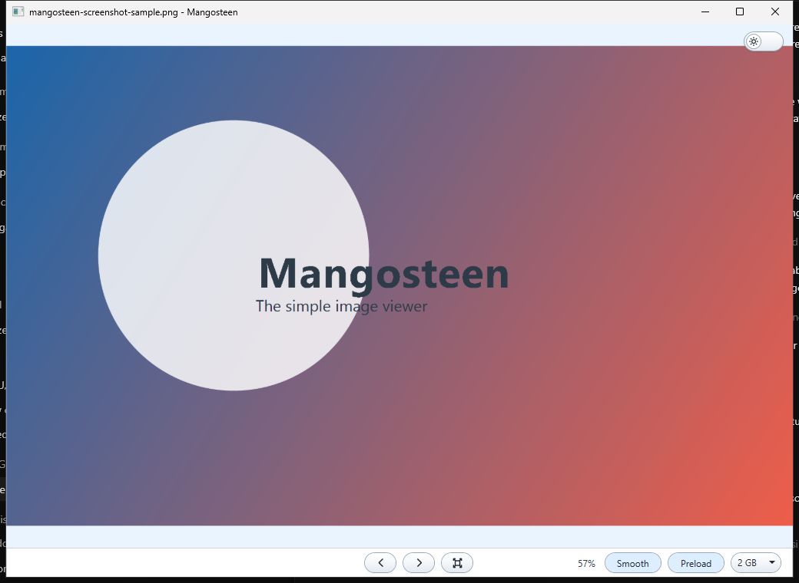

# Mangosteen Image Viewer

[](https://github.com/sapere-aude-incipe/mangosteen-image-viewer/actions/workflows/ci.yml)

Mangosteen is a simple and fast Windows image viewer inspired by the classic Windows Photo Viewer experience. It focuses on quick folder navigation, smooth zooming, actual-pixel viewing, broad image format support, animated GIF playback, and responsive handling of very large images.



## Features

- Previous and next navigation through images in the current folder.
- Mouse-wheel zoom anchored under the cursor.
- Left-button drag panning when the image is larger than the viewport.
- Actual-pixel viewing for `1:1` physical pixel mapping.
- Smooth or nearest-neighbor upscaling.
- Light and dark themes.
- Smart preloading with a configurable memory budget.
- Preview-first loading for very large images and RAW-family files.
- Animated GIF support.
- Installer and portable zip builds for Windows x64.

## Supported Formats

Mangosteen uses a decoder chain rather than a single hard-coded codec. The current chain is WIC embedded RAW preview first, libvips second, Windows Imaging Component third, SkiaSharp fourth, and Magick.NET last.

Common formats such as JPEG, PNG, BMP, GIF, TIFF, WebP, AVIF, HEIC/HEIF, and several RAW-family formats are intended to work through that chain, depending on the format, file contents, and installed Windows codecs.

## Download

The first public releases are unsigned while the project builds reputation for code signing.

1. Open the [Releases](https://github.com/sapere-aude-incipe/mangosteen-image-viewer/releases) page.
2. Download either the setup `.exe` or the portable `.zip`.
3. Download `SHA256SUMS.txt`.
4. Verify the file before running it:

```powershell
Get-FileHash .\Mangosteen-Setup-0.1.0-x64.exe -Algorithm SHA256
Get-Content .\SHA256SUMS.txt
```

Windows SmartScreen may show a warning for unsigned preview releases.

## Build

Requirements:

- Windows 10 or later.
- [.NET 10 SDK](https://dotnet.microsoft.com/download).
- Inno Setup 6, only if you want to build the installer.

Build and test:

```powershell
dotnet restore ClassicPhotoViewer.slnx
dotnet build ClassicPhotoViewer.slnx --configuration Release --no-restore
dotnet test ClassicPhotoViewer.slnx --configuration Release --no-build
```

Run from source:

```powershell
dotnet run --project ClassicPhotoViewer.csproj -- "C:\path\to\image.jpg"
```

Build release artifacts:

```powershell
powershell -NoProfile -ExecutionPolicy Bypass -File .\scripts\build-installer.ps1
```

This creates:

- `dist\Mangosteen-Setup-<version>-x64.exe`
- `dist\Mangosteen-Portable-<version>-x64.zip`
- `dist\SHA256SUMS.txt`

To build only the portable zip:

```powershell
powershell -NoProfile -ExecutionPolicy Bypass -File .\scripts\build-installer.ps1 -SkipInstaller
```

## Controls

- `Left` / `Right`: previous / next image.
- Mouse wheel: zoom around the cursor.
- Left mouse drag: pan.
- `F`: fit to window.
- `Ctrl+O`: open an image.

## Release Process

CI builds and tests every push and pull request on Windows. Tagged releases named like `v0.1.0` run the release workflow, build unsigned Windows artifacts, generate `SHA256SUMS.txt`, upload the artifacts, and create a prerelease.

The intended signing path is SignPath Foundation once the project has enough public reputation for open-source code signing.

## License

Mangosteen Image Viewer is released under the MIT License. See [LICENSE](LICENSE).
